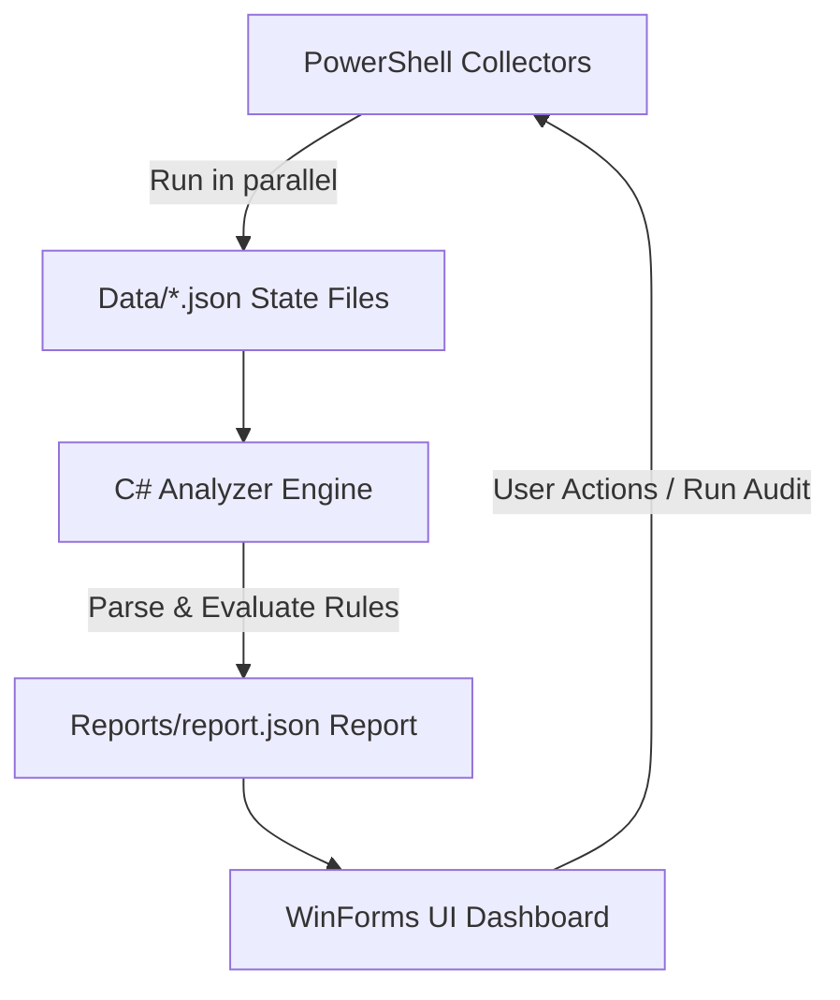

# Developer Workstation Auditor

**"Why is my PC slow?"** — A lightweight, dark-themed system diagnostics dashboard for Windows developers. It goes beyond generic task managers by auditing developer-specific issues: WSL2 disk bloat, leaked compiler processes, massive package caches, dangling Docker resources, PATH configuration errors, and registry limits.

---

## 1. What is it?

The **Developer Workstation Auditor** is an audit and monitoring suite designed specifically for developers. It collects raw system diagnostics, performs rule-based analysis, and displays health indicators on a responsive dashboard.

### Core Features
*   **System Health Summary:** OS version details, hardware specifications, uptime, and RAM consumption.
*   **Health Score Gauge:** A color-coded health gauge scoring your PC from `0` to `100`.
*   **Warnings & Alerts Panel:** Displays prioritized warnings (High/Medium/Info) with specific issues detected.
*   **Actionable Recommendations:** Suggests quick solutions (e.g. system cleanups) with built-in automated **Action** buttons.
*   **Grid Dashboards:** Detailed tables for active processes (with in-app **Kill ✕** buttons), startup registry entries, and established/listening network connections.
*   **Dev Environment Analyzer:** Real-time size checks on WSL2 virtual disks, Docker container/image counts, package cache directories (npm, NuGet, Gradle, pip, etc.), and PATH tool presence.
*   **Disk Usage Visualizer:** Dynamic progress bars detailing drive space, with warnings for low disk space.

---

## 2. What Problem Does it Solve?

Standard diagnostics tools (like Windows Task Manager or Resource Monitor) only display raw OS telemetry. They do not know about modern development ecosystems. This tool solves the following developer pain points:

1.  **WSL2 Virtual Disk Growth (VHDX Bloat):** WSL2 virtual disks grow automatically but never shrink when files are deleted inside Linux. The auditor detects virtual disk sizes and offers a one-click shutdown to release locked locks or prepare for optimization (`Optimize-VHD`).
2.  **Orphaned Dev/Compiler Processes:** Build toolchains (such as `MSBuild`, `VBCSCompiler`, `node`, `git`, or language servers) frequently leak and run in the background, consuming CPU and RAM long after you close your IDE. The app groups, highlights, and lets you kill these "zombies" instantly.
3.  **Bloated Package Caches:** Package managers cache dependencies indefinitely. Caches like npm, NuGet, pip, Cargo, and Gradle can easily grow to `30GB+` in the user profile directory. The auditor scans these directories and warns when they exceed healthy thresholds.
4.  **Dangling Docker Resources:** Stopped containers, unused networks, and old images consume disk space. The dashboard scans Docker CLI stats and provides a quick `docker system prune` action button.
5.  **Long PATH & Registry Limits:** Windows has a default `260` character file path limit. If the registry key `LongPathsEnabled` is disabled, build tools often fail with obscure errors. The auditor warns you about this limit and provides a elevated one-click registry fix.

---

## 3. How to Use It

### Option A — Install via Windows Installer (Recommended for Users)
The compiled installer executable (`WorkstationAuditorSetup.exe`) is git-ignored to prevent repository bloat. You can obtain it in two ways:
1. Download the latest installer from the **GitHub Releases** page (once published).
2. Build the installer locally by running the build script: `.\scripts\build-installer.ps1` (see Option C below).

**Installation Steps:**
1. Run the installer to set up the dashboard.
   *Note: Since the installer is unsigned, Windows **Smart App Control** or SmartScreen may block it. Make sure to disable Smart App Control (or select "More info" -> "Run anyway") to proceed.*
2. The installer automatically configures the current user's PowerShell execution policy to `RemoteSigned` (allowing the background collector scripts to run).
3. Launch **Developer Workstation Auditor** from your desktop or Start menu and click **▶ Run Audit** to update the diagnostics.

### Option B — Run from Source (Recommended for Developers)
Ensure you have [.NET SDK 10.0](https://dotnet.microsoft.com/download) installed.

```powershell
# 1. Collect system metrics (saves raw state in Data/*.json)
powershell -NoProfile -ExecutionPolicy Bypass -File .\AuditCollector.ps1

# 2. Run the C# analyzer engine (generates Reports/report.json)
dotnet run --project Auditor/Auditor.csproj

# 3. Launch the WinForms GUI Dashboard
dotnet run --project Auditor.UI/Auditor.UI.csproj
```

*Note: The UI dashboard will automatically trigger steps 1 and 2 on first startup if no report files exist.*

### Option C — Build and Package Locally
*   **Publish Single-File EXE:**
    ```powershell
    .\scripts\publish-windows.ps1 -Runtime win-x64 -Configuration Release
    ```
    This publishes a self-contained, trimmed executable inside the `publish/` directory and copies all required collector scripts alongside it.
*   **Compile Setup Installer:**
    Ensure [Inno Setup 6](https://jrsoftware.org/isinfo.php) is installed, then run:
    ```powershell
    .\scripts\build-installer.ps1
    ```
    This compiles the single-file publisher output and generates the setup installer inside the `dist/` directory.

---

## 4. How It Was Made (Full Orchestration)

The application uses a modular, decoupled architecture consisting of four separate phases working together:



### Phase 1: PowerShell Data Collectors
The data collection is performed by a set of lightweight PowerShell scripts:
*   `AuditCollector.ps1`: Parent script that orchestrates running the other scripts.
*   `Collector-Machine.ps1`: Queries CPU name, RAM size, OS build, and boot time using CIM/WMI.
*   `Collector-Processes.ps1`: Gathers running processes, sorting by memory and CPU.
*   `Collector-Disk.ps1`: Audits active drives, partition letters, and sizes.
*   `Collector-Network.ps1`: Uses TCP connection tables to identify established sockets and map them to parent processes.
*   `Collector-DevEnv.ps1`: Scans user directories for package caches (NuGet, npm, pip, Gradle, Yarn, etc.), checks running WSL distros, executes `docker info`, and tests tool paths (`git`, `node`, `docker`, `dotnet`).

### Phase 2: Core C# Analyzer Engine (`Auditor`)
*   A standalone C# class library (`WorkstationAuditor.Models` and `WorkstationAuditor.Services`).
*   Parses the machine state JSONs from the `Data/` directory.
*   Runs rule checks against standard thresholds (e.g. Uptime > 7 days, Disk usage > 90%, RAM > 85%, PATH length > 2048, missing tools).
*   Calculates a final Health Score based on warning counts and severity.
*   Generates actionable recommendations and outputs `Reports/report.json`.

### Phase 3: WinForms UI Dashboard (`Auditor.UI`)
*   Built using modern C# WinForms with double buffering to eliminate screen flicker.
*   Features a responsive, dark Catppuccin Mocha-themed design system.
*   **High-DPI Compatibility:** Uses `TableLayoutPanel` and `FlowLayoutPanel` with automatic wrap-around text columns to ensure elements never overlap, even under scaling settings like 125% or 150%.
*   **Scrollable Containers:** Utilizes borderless, read-only rich text boxes inside environment cards, allowing long tool arrays or WSL stats to scroll neatly instead of clipping.
*   **Auto-Watch File System:** Sets up a `FileSystemWatcher` on the `Reports/` directory to instantly reload and invalidate drawing surfaces whenever a new audit finishes.

### Phase 4: Build & Release Automation
*   `publish-windows.ps1` publishes the C# project using .NET Core's self-contained single-file compiler flag (`PublishSingleFile=true`) targeting Windows (`win-x64`).
*   `build-installer.ps1` invokes the Inno Setup Compiler (`ISCC.exe`) to build a compressed Windows Installer payload, adding registry changes to configure user script execution privileges.

---
