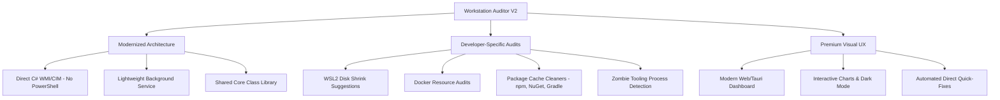

# Codebase & Architecture Audit: Windows Monitor (Workstation Auditor)

This document provides a comprehensive audit of the `windows-monitor` repository, outlining architectural design issues, implementation bugs, user sanity/usability assessments, and proposals for modernizing and enhancing the application.

---

## 1. Design & Architectural Issues

### 1.1. Redundancy & Confusing Project Entrypoints
The repository contains two completely separate and disjoint diagnostic engines:
1. **The Root CLI Tool (`WindowsMonitor.csproj`):** A C# console application that invokes `diagnostics.ps1` via PowerShell, parses its stdout JSON, and prints it back to the console.
2. **The Auditor Suite (`Auditor/` & `Auditor.UI/`):** A multi-project setup where `AuditCollector.ps1` runs 7 separate PowerShell scripts, writes data to `Data/*.json`, runs `Auditor` to analyze the JSON data and produce `Reports/report.json`, and displays the results in a WinForms dashboard (`Auditor.UI`).

There is no code sharing, common data models, or functional synergy between these two setups, which creates major confusion for developers and users alike.

### 1.2. Fragile, Hardcoded Pathing and Directory Traversal
The system relies on traversing parent folders of the execution path (`AppDomain.CurrentDomain.BaseDirectory`) to find repository resources. 
* **The Distribution Bug:** The `publish-windows.ps1` script claims you can publish a self-contained single-file EXE, copy it to any machine, and double-click to run. However, `Auditor.UI`'s `MainForm.cs` relies on `FindFileInParents("AuditCollector.ps1")` to invoke the collectors. If the published EXE is run outside the source tree (e.g., on a user's desktop), the search will return `null` and the initial setup/audit run will fail completely with:
  `Cannot find AuditCollector.ps1 in parent folders.`
* **Inconsistent Temp Storage:** Raw files are written to `./Data` and reports to `./Reports`. If run from different directories, relative pathing will write files into whatever directory the terminal was pointing to, rather than a reliable user folder like `%APPDATA%`.

### 1.3. Outdated, Monolithic UI Technology
The dashboard is built using **Windows Forms (WinForms)**.
* **Platform Lock-in:** Using WinForms restricts the dashboard strictly to Windows (while .NET 10.0 is cross-platform).
* **Manual Layout Constraints:** Controls are manually positioned using hardcoded pixel offsets (e.g., `lblTitle.Top = 10; lblTitle.Left = 10;`, `btnRefresh.Size = new Size(100, 36)`). This violates modern desktop design principles and renders poorly on modern High-DPI screens, leading to overlapping text or clipped controls when resized.
* **Violation of Separation of Concerns:** `MainForm.cs` contains more than 800 lines of code, managing UI drawing, background process spawning, file system watchers, retry loops, log file writing, and direct process termination. This lack of architectural patterns (like MVP or MVVM) makes maintenance highly error-prone.

### 1.4. Silent Deserialization Failures
The `JsonLoader.cs` class catches all deserialization exceptions and silences them:
```csharp
catch
{
    return Enumerable.Empty<T>();
}
```
If a PowerShell collector fails, produces malformed JSON, or the JSON schema diverges from C# models, the failure is hidden. The application will simply display empty grids and warnings without informing the user that data collection or parsing failed.

---

## 2. Implementation Issues & Bugs

### 2.1. Critical Bug: Flawed RAM Usage Calculation
In `HealthAnalyzer.cs`, RAM usage is calculated using:
```csharp
double totalProcMb = procList.Sum(p => p.MemoryMb);
double totalMemMb = machine.TotalMemoryGB * 1024.0;
double memUsedPercent = totalMemMb > 0 ? (totalProcMb / totalMemMb) * 100.0 : 0.0;
```
This calculation has several fundamental errors:
1. **Working Set Summation != System Memory Usage:** Summing individual process Working Sets (`$_.WorkingSet`) does not equal total physical memory usage. It counts shared memory pages multiple times and completely ignores memory used by the OS kernel, file system caches, hardware drivers, and system page tables.
2. **Privilege-dependent Results:** If `Get-Process` is run without elevated Administrator privileges, it cannot access the memory statistics of core system processes and processes running under other users, leading to a massive underestimate of memory usage.
3. **Ignored Diagnostic Script:** The root `diagnostics.ps1` script correctly queries the operating system for memory usage via CIM (`TotalVisibleMemorySize` and `FreePhysicalMemory` from `Win32_OperatingSystem`), but the `Auditor` library completely ignores this script and relies on the broken process-sum logic instead.

### 2.2. Performance Bottleneck in Network Connection Collector
In `Collector-Network.ps1`, the script attempts to resolve the process name for each active connection:
```powershell
Get-NetTCPConnection -ErrorAction SilentlyContinue | ForEach-Object {
    $proc = $null
    try { $proc = (Get-Process -Id $_.OwningProcess -ErrorAction SilentlyContinue).ProcessName } catch {}
    ...
}
```
Invoking `Get-Process` inside a loop for each active connection triggers sequential process lookups. On a typical developer workstation with hundreds or thousands of active sockets, this causes high CPU usage and makes the network collection stage take several minutes to run.

### 2.3. UI Thread Blocking via File Watcher
`MainForm.cs` registers a `FileSystemWatcher` to detect changes to `report.json`. Because file write operations can be slow, a retry loop is used in `RefreshReport()` to avoid read-write sharing violations:
```csharp
while (!parsed && attempts < 6)
{
    attempts++;
    try { ... }
    catch (System.IO.IOException) {
        System.Threading.Thread.Sleep(120);
    }
}
```
Because the filesystem event handler invokes `RefreshReport` on the main UI thread, executing `Thread.Sleep(120)` in a retry loop blocks the UI message loop. This causes the entire dashboard application to freeze for up to 720ms whenever a report is written.

### 2.4. Misconfigured Class Library Outputs
The `Auditor.csproj` is configured as a console application:
```xml
<OutputType>Exe</OutputType>
```
However, it is referenced and used as a class library by `Auditor.UI.csproj`. It should be configured with `<OutputType>Library</OutputType>` to prevent compiling unnecessary entrypoint wrappers and to conform to standard .NET architecture.

---

## 3. Sanity & Usability Analysis: Is this application useful?

**Verdict: Barely Useful (In its current state)**

While the intention behind the application ("Why is my PC slow?") is good, the current implementation provides no value beyond what is already easily accessible in Windows:

| Feature | Workstation Auditor | Built-in Windows Alternative | Comparison / Verdict |
| :--- | :--- | :--- | :--- |
| **Active Processes** | Static grid of top 25 processes sorted by memory. | **Task Manager** (Ctrl+Shift+Esc) / **Resource Monitor** | Windows provides real-time updates, sorting, search, CPU/Disk/Network metrics, and process trees. |
| **Startup Programs** | Lists startup keys and folders. | **Task Manager > Startup Apps** | Windows allows enabling/disabling items directly in a modern UI with startup impact metrics. |
| **Disk Space Analysis** | Warns if drive capacity > 80% or 95%. | **File Explorer** / **Storage Sense** | Windows provides visual bars, clean-up recommendations, and auto-cleanup mechanisms. |
| **Reboot Recommendation** | Alerts if uptime is > 14 days. | **Task Manager > Performance > CPU (Uptime)** | Built-in taskbar/performance view displays this instantly. |
| **Recommendations** | Alerts like "Close Chrome tabs" or "Add more RAM". | Common Sense / General Knowledge | The tool's recommendations are highly generic. |
| **Action Execution** | Spawns Task Manager or Disk Cleanup. | Opening them directly | The tool's "Quick Fix" just delegates to the OS built-in tools. |

### Major Gaps
* **Lack of Real-time Tracking:** Spawning a batch of PowerShell scripts is a heavy, slow operation. It cannot be used for real-time monitoring because running it continuously would consume significant CPU resources.
* **Not Developer-Focused:** Despite being called the "Developer Workstation Auditor", it fails to inspect resources that are typical sources of friction for developers (e.g., Docker, WSL2 virtual disks, package caches, compiler daemons, path configuration, IDE processes).

---

## 4. Ideas to Enhance the Application

To transform this repository into a highly premium, state-of-the-art developer tool, we should implement the following enhancements:



### 4.1. Core Architectural Enhancements
* **Eliminate PowerShell Execution Overhead:** Port all collector scripts (`Collector-*.ps1`) directly into C# using native APIs (e.g., `System.Diagnostics.Process`, `System.IO`, and `.NET CIM Client` via `Microsoft.Management.Infrastructure`). This avoids shell execution overhead, bypasses execution policy security issues, runs in milliseconds instead of seconds, and removes path dependency bugs.
* **Background Worker Service:** Rebuild the app as a lightweight background Windows Service or tray application. It can collect metrics silently in the background and expose them via a local REST API or WebSocket, allowing real-time monitoring without heavy script runs.
* **Standardize Projects:** Convert `Auditor.csproj` to a standard Class Library and share it between the UI project and a single CLI project, removing the redundant `WindowsMonitor` root project.

### 4.2. Developer-Specific Audits (High Value)
To make the tool genuinely useful for developers, implement diagnostic checks tailored to development environment bottlenecks:
1. **WSL2 Disk Bloat Inspector:** WSL2 utilizes virtual disks (`.vhdx`) that expand dynamically but never contract automatically. The auditor should detect large `.vhdx` files and offer to shrink them using `diskpart` / `Optimize-VHD`.
2. **Docker Desktop Auditor:** Monitor Docker resources, highlighting dangling images, unused volumes, and active containers consuming memory limits.
3. **Developer Cache Scanner:** Scan and report storage consumed by dev package managers (`~/.npm`, `~/.nuget/packages`, `~/.gradle`, `~/.m2`, `Pip/Cache`, `Cargo/registry`). Offer direct buttons to clear these caches.
4. **Zombie Compiler/Runtime Processes:** Detect compiler instances (like orphaned `node.exe`, `dotnet.exe`, `msbuild.exe`, `java.exe`, `lldb.exe`) that continue running in the background after their parent IDE (VS Code, Visual Studio, IntelliJ) has closed.
5. **Path and Config Auditor:** Check system variables (e.g., check if `LongPathsEnabled` registry key is set, audit length of `%PATH%`, inspect missing core CLI compilers like `git`, `docker`, or `node`).

### 4.3. Premium User Interface & Visuals
* **Adopt Web/Tauri or Modern WPF UI:** Replace WinForms with a modern stack like **Tauri + React/Vite** or a modern **WPF/WinUI 3** app with styled Fluent or Glassmorphism aesthetics.
* **Interactive Data Visualization:** Display memory breakdown, disk space usage, and history metrics using interactive charts (e.g., canvas-based charts or modern UI chart controls) instead of plain list text.
* **Direct Actions (True Quick Fixes):** Instead of spawning `taskmgr.exe`, allow terminating processes directly in-app, clearing directories directly, or restarting WSL2 with `wsl --shutdown` directly from the dashboard interface.
